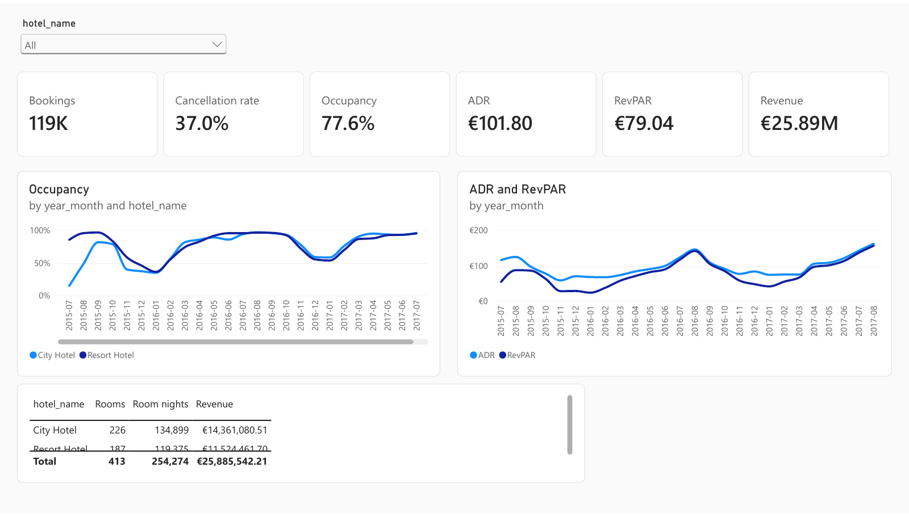

# Two hotels, 119,390 bookings

[View the project](https://manisha-subedi.github.io/hotel-bookings/)

Booking and revenue analysis for a resort in the Algarve and a city hotel
in Lisbon, covering July 2015 to August 2017.

The project includes a Power BI report and a web page with monthly charts,
a historical cancellation lookup, and an overbooking cost calculator.

```
Bookings: 119,390
Cancellation rate: 37.0%
Cancellation rate for lead times of 181+ days: 57.0%
Late cancellation or no-show rate, active 7 days before arrival:
  City Hotel: 8.5%
  Resort Hotel: 4.8%
Estimated capacity:
  City Hotel: 226 rooms
  Resort Hotel: 187 rooms
```

## Power BI report

The five pages cover overall performance, demand and channels, customers,
cancellations, and individual booking details. The model loads six tables
from `powerbi/hotel-bookings-tables.xlsx` and uses seven relationships.

- `powerbi/hotel-bookings.pdf`: the report export.
- `powerbi/page-1-overview.png` to `page-5-booking-detail.png`: page images.
- `powerbi/model.png`: the data model.
- `powerbi/measures.dax`: DAX measures with explanatory comments.
- `powerbi/GUIDE.md` and `GUIDE-web.md`: setup instructions.



## Run the project

```bash
uv venv && uv pip install -e ".[dev]"
python build.py
pytest
python -m http.server --directory site
```

`build.py` downloads the CSV, builds the tables in `hotel.duckdb`, and
writes four JSON files to `site/data/`. The browser reads these files to
draw the charts and run the calculators. No backend service or machine
learning model is required.

## Data model

The source is a flat table with 32 columns. The SQL files transform it into
the following tables:

| Table | Rows | Description |
|---|---|---|
| `dim_date` | 1,064 | Continuous dates from the first status date to the last departure |
| `dim_hotel` | 2 | Hotel, location, and estimated room capacity |
| `dim_customer` | 448 | Country, customer type, and repeat-guest status |
| `dim_channel` | 26 | Market segment and distribution channel |
| `fact_booking` | 119,390 | One row per booking |
| `fact_night` | 255,040 | One row per occupied room night |
| `kpi_hotel_month` | 54 | Monthly occupancy, ADR, and RevPAR by hotel |

Separate date relationships support analysis by arrival date and
cancellation date.

## Estimated room capacity

The source does not include room capacity. I estimated it from the busiest
occupied night: 226 rooms for the city hotel and 187 for the resort.
Occupancy and RevPAR depend on these estimates.

Occupancy divides occupied room nights by available room nights, using
room capacity multiplied by the number of days. A test guards against
a denominator error that would produce 100 percent occupancy every month
in this dataset.

## Late cancellations

The overall cancellation rate includes bookings cancelled well before
arrival. For overbooking scenarios, the calculator instead uses the share
of bookings still active near arrival that later cancel or do not show up.

The build calculates this rate at 1, 3, 7, 14, and 30 days before arrival.
Users can select a timeframe or enter a different rate.

## Overbooking assumptions

The calculator assumes each booking cancels independently at the selected
rate. For each number of extra bookings, it calculates expected empty
rooms and relocated guests, then applies the costs entered by the user.

The lowest-cost result is a model estimate under those assumptions, not an
operational recommendation. The default empty-room cost uses ADR; the
relocation cost is illustrative. Annual cost differences assume the same
conditions every night and should not be read as forecast savings.

The calculation is in `expectedCost` in `site/app.js`.

## Tests

```bash
pytest
```

Tests cover booking counts, date continuity, valid keys, occupied room
nights, capacity estimates, occupancy, the RevPAR identity, and headline
totals.

## Data source

Hotel booking demand, by Nuno Antonio, Ana de Almeida and Luis Nunes.
Published in Data in Brief, 2019, under CC BY 4.0. The build downloads the
data from the TidyTuesday mirror.
